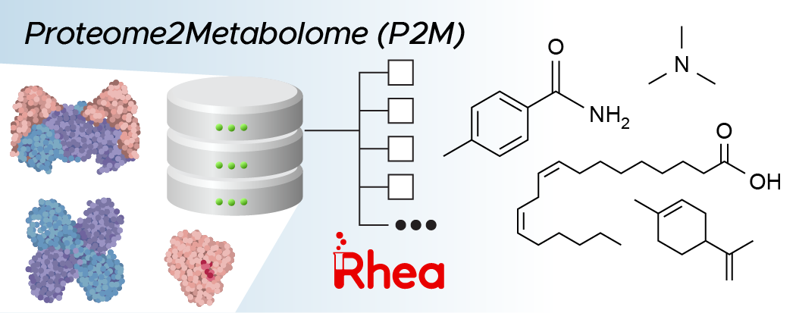

# P2M: Map protein identifiers to metabolites

<p align="center">
  
</p>

## Installation

Create and activate conda environment:

```bash
conda create -n p2m -c rdkit -c openbabel python rdkit openbabel pandas
conda activate p2m
```

Clone and setup p2m:

```bash
pip install git+https://github.com/pnnl/p2m
```

## Run

```bash
p2m --input IDS_PATH --type IDS_TYPE [OPTIONS]
```

For instance, in the [included example](resources/example_run.zip), the following command was used
to query UniProt identifiers with R-group completion and SMILES cleaning:

```bash
p2m --input example_run/ecoli_k12_mg1655_uniprotkb.txt --type uniprot -rc
```

See `--help` for more details:

```
$ p2m --help
usage: p2m [--help] --input IDS_PATH --type IDS_TYPE [--output OUTPUT_PATH]
           [--complete_rgroups] [--clean_smiles] [--sleep SLEEP]

---
P2M
---

Identify metabolites (substrates and products) of proteins from UniProt identifiers or EC numbers. Requires internet access for external database queries. 

To set up local databases for your first run, be sure to run the 'download' command.

options:
  --help, -h            Show help documentation.
  --input IDS_PATH, -i IDS_PATH
                        Path to UniProt or EC identifiers; file must be a list of identifiers separated by newlines.
  --type IDS_TYPE, -t IDS_TYPE
                        Type of identifiers. One of: UniProt, EC
  --output OUTPUT_PATH, -o OUTPUT_PATH
                        Path to desired output folder.
  --complete_rgroups, -r
                        Externally query the ChEBI database for substructure searches of compounds with R-groups. Default False.
  --clean_smiles, -c    Pass SMILES through a set of standardizations. Default False.
  --sleep SLEEP, -s SLEEP
                        Sleep time in seconds between query calls.
```

## Authors

* Bryan Killinger (@brykpnl)
* Christine Chang (@christinehc)
* Ryan Renslow
* Sean Colby (@smcolby)

## License

P2M is licensed under the BSD 3-Clause License; see the [LICENSE](LICENSE) for details.